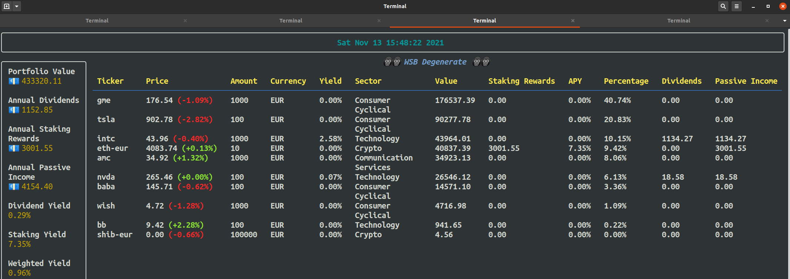
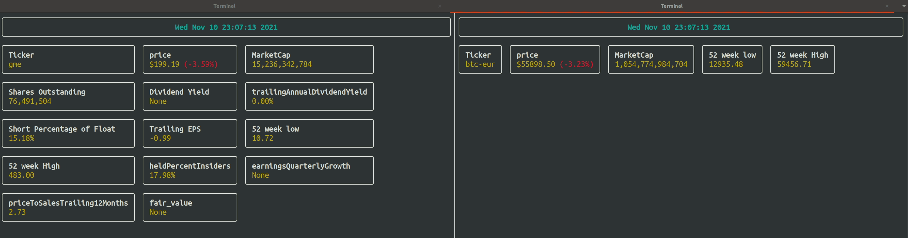

[](https://codecov.io/gh/AramKoorn/TenBagger)
[](https://tenbagger.readthedocs.io/en/latest/?badge=latest)

# TenBagger, Find your next TenBagger inside your terminal
Why paying for expensive subscriptions to track your portfolio, dividends and crypto? This library aims to be a complete tool to track and analyse your financial portfolio using the Command Line Interface (CLI). All the features of TenBagger will be displayed as a Textual User Interface (TUI) inside your terminal. 

This library uses the [yfinance](https://github.com/ranaroussi/yfinance) API to fetch the market data. So you need to use the ticker symbols as they are on Yahoo finance. This also means that the stability of TenBagger is bound to the stability of Yahoo finance.

## Compatibility 
Linux/macOS or any other unix based system.

## Installation
```
git clone https://github.com/AramKoorn/TenBagger 
cd TenBagger
python3 setup.py install && pip3 install .
```
Check if installation worked:
```
tenbagger -v
```
## Getting Started

Add/modify a portfolio with

```
tenbagger --configure
```
Alternatively, modify the portfolio.yaml in the user_data/portfolio/ folder.

## Usage
Real-time overview of portfolio. The portfolio automatically gets updated with the real-time stock/crypto prices while the app is running. The app can be closed by hitting q or CTRL+C.

```sh
tenbagger --portfolio WSB
```


Simulate passive income of dividend payouts and staking rewards

```
# portfolio: Name of portfolio specified in config/portfolio.yaml
# n: number of months
# stockgrowth: yearly Stock growth rate 
# dividendgrowth: yearly dividend growth
# m: montlhy payment
# crypto: boolean to include crypto in simulation
# report: Boolean to generate csv report of simulation

tenbagger --scenario -n 120 --stockgrowth 0.03 --dividendgrowth 0.03 -m 1000 --crypto --report --portfolio my_portfolio

```

Show different metrics of the listed ticker. Note that this is supported for both stonks and crypto.
```sh
$ tenbagger --overview aapl
$ tenbagger --overview btc-eur

```



Candlestick chart
```
tenbagger --candle --ticker ibm  --period 700d --interval 1d
```

Get overview of latest ticker information


Run tracker dashboard
```
tenbagger --tracker
```

## Crypto

Because everything is stored on the the blockchain it's quite easy to directly pull your crypto balance from the blockchain. However, every blockchain got it's own API so we are going to add more crypto over time. The advantage is that you can input your blockchain address in your crypto wallet directly in the portfolio config and all you account balance changes are automatically updated in the analysis. E.g.

```
# This address is from the algorand foundation
my_portfolio:
  algo-eur: 3C5IFPAZLET3FLGGFK5AXN7NISVD3OCOMEZJESCXUNUHDOIPMVKYB4DILM

```
We will add more blockchains over time. Currentlly supported blockchains are:
- Algorand

## Tasks
- [ ] Create on click button to refresh portfolio on demand
- [ ] Show % change compared to close yesterday
- [x] Use Panel/column view for company overview
  - [ ] red/green if above or below fair value
- [ ] track portfolio over time using postgres as backend
- [ ] GAK
- [x] Portfolio properties
  - [x] Total dividends
  - [x] Total staking rewards
  - [x] Total passive income
- [ ] Pull upcoming ex dividend dates
- [x] Use textual for interactive dashboard inside terminal!
- [x] Update portfolio class
  - [x] portfolio.pulse()
  - [x] Decide on final design of columns
